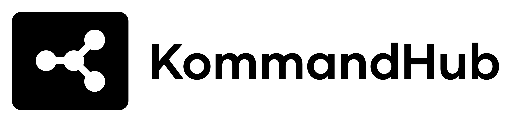

<p align="center">
  
</p>

# Kommandhub Demo Data SW

A Shopware 6 plugin for seeding high-quality demo data (categories, property groups, and products) into your store.

## Features

- **Interactive Seeding**: Guides you through selecting parent categories and CMS pages.
- **Bulk Data Generation**: Efficiently creates categories, property groups, and products.
- **Deterministic IDs**: Uses UUIDs derived from names to prevent duplicate creation on multiple runs.
- **Docker-Ready**: Comes with a pre-configured development environment.
- **Modern Standards**: Full support for PHPUnit, PHPStan, and PHP-CS-Fixer.

## Getting Started

### Prerequisites

- Docker and Docker Compose
- Make

### Installation

1. Clone this repository into your Shopware `custom/plugins/` directory.
2. Navigate to the plugin directory:
   ```bash
   cd custom/plugins/KommandhubDemoDataSW
   ```
3. Start the development environment:
   ```bash
   make up
   ```

## Usage

To seed the demo data, run the following command inside the container:

```bash
bin/console kommandhub:seed-demo-data
```

> [!INFO]
> This command should be run **once** to populate your store with initial demo data. While it uses deterministic UUIDs to avoid duplicates, running it multiple times might overwrite custom changes to the generated entities.

## Development

### Running Tests
```bash
make test
```

### Static Analysis
```bash
make analyse
```

### Coding Standards
```bash
make cs
make cs-fix
```

## License

This project is licensed under the MIT License - see the [LICENSE](LICENSE) file for details.
